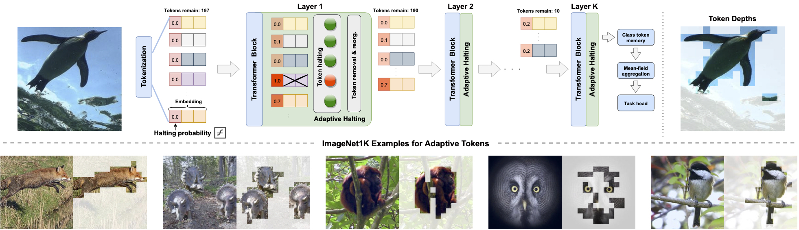
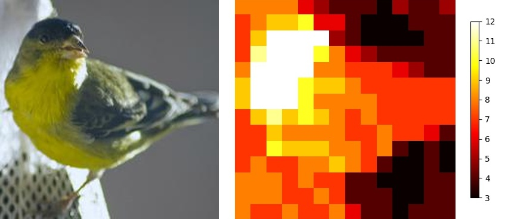
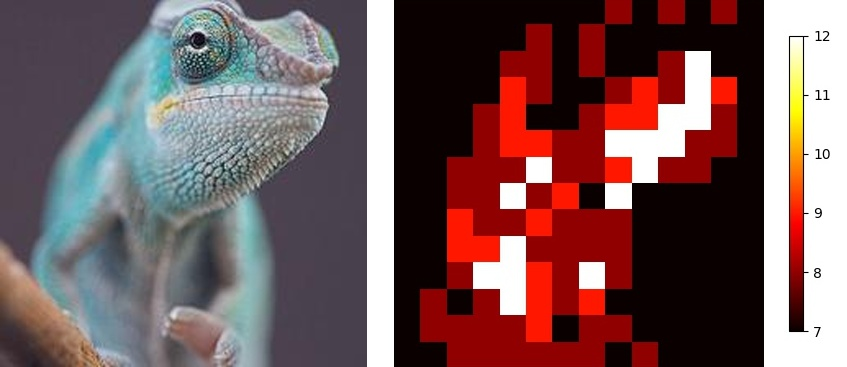
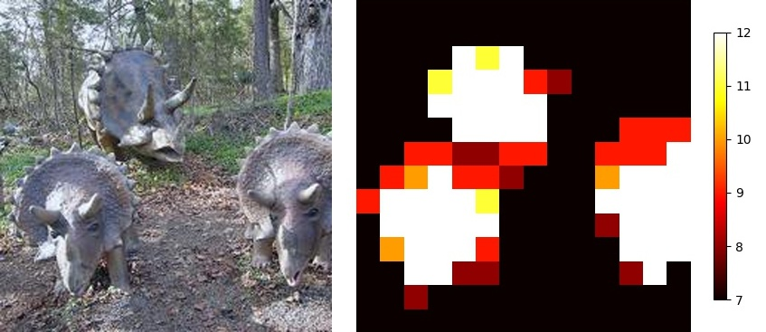

# A-ViT: Adaptive Tokens for Efficient Vision Transformer

This repository is the official PyTorch implementation of [A-ViT: Adaptive Tokens for Efficient Vision Transformer](https://openaccess.thecvf.com/content/CVPR2022/html/Yin_A-ViT_Adaptive_Tokens_for_Efficient_Vision_Transformer_CVPR_2022_paper.html) presented at CVPR 2022.

The code enables adaptive inference of tokens for vision transformers. Current version includes training, evaluation, and visualization of models on ImageNet-1K. We plan to update repository and release run-time token zipping for inference, distillation models, and base models in coming versions.

Useful links: <br>
[[Camera ready]](https://openaccess.thecvf.com/content/CVPR2022/html/Yin_A-ViT_Adaptive_Tokens_for_Efficient_Vision_Transformer_CVPR_2022_paper.html) <br>
[[ArXiv Full PDF]](https://arxiv.org/abs/2112.07658#:~:text=We%20introduce%20A%2DViT%2C%20a,the%20network%20as%20inference%20proceeds.)<br>
[[Project page]](https://a-vit.github.io/)<br>




## Requirements

Code was tested in virtual environment with Python 3.6. Install requirements as in the requirements.txt file.

## Commands

### Data Preparation

Please prepare the ImageNet dataset into the following structure:

```bash
  imagenet
  ├── train
  │   ├── class1
  │   │   ├── img1.jpeg
  │   │   ├── img2.jpeg
  │   │   └── ...
  │   ├── class2
  │   │   ├── img3.jpeg
  │   │   └── ...
  │   └── ...
  └── val
      ├── class1
      │   ├── img4.jpeg
      │   ├── img5.jpeg
      │   └── ...
      ├── class2
      │   ├── img6.jpeg
      │   └── ...
      └── ...

```

### Training an A-ViT on ImageNet-1K

This snippet will support the training of A-ViT on ImageNet-1K. Please place the ImageNet dataset accordingly as above. For starting point of pretrained DEIT weights the code shall automatically load as below with **--pretrained** key. Please refer to [here](https://github.com/facebookresearch/deit) or in the **models_act.py** code URLs if facing loading or downloading issues.

Code is tested on NVIDIA 4-V100 GPUs cluster of 32GB memory. Training takes 100 epochs.

For tiny model:
```bash
python -m torch.distributed.launch --nproc_per_node=4 --use_env main_act.py --model avit_tiny_patch16_224 --data-path <data to imagenet folder> --output_dir ./results/<name your exp for tensorboard files and ckpt> --pretrained --batch-size 128 --lr 0.0005 --tensorboard --epochs 100 --gate_scale 10.0 --gate_center 30 --warmup-epochs 5 --ponder_token_scale 0.0005 --distr_prior_alpha 0.001
```

For small model:
```bash
python -m torch.distributed.launch --nproc_per_node=4 --use_env main_act.py --model avit_small_patch16_224 --data-path <data to imagenet folder> --output_dir ./results/<name your exp name> --pretrained --batch-size 96 --lr 0.0003 --tensorboard --epochs 100 --gate_scale 10.0 --gate_center 75 --warmup-epochs 5 --ponder_token_scale 0.0005 --distr_prior_alpha 0.001
```

Arguments:
- `batch-size` - batch size.
- `tensorboard` - write training and testing stats for tracking purposes.
- `lr` - learning rate.
- `epochs` - epochs to fine-tune. If --pretrained is not raised, this is epochs for total training.
- `pretrained` - flag to load starting full pretrained static models to start learning for adaptive inference capability.
- `ponder_scale_token` - regularization constant for token ponder loss scaling.
- `gate_scale` - scaling factor for H gate, constant shared across all tokens at all layers.
- `gate_center` - absolute value of the negative bias for H gate, constant shared across all tokens at all layers.
- `distr_prior_alpha` - regularization constant for kl divergence distributional prior.
- `finetune` - loading avit weights.
- `demo` - raise to save and visualize token depth distribution after loading avit weights using the finetune command. This saves (i) original image, (ii) token depth distribution, and (iii) their left-right concatenation in jpg files.


### Pretrained Weights on ImageNet-1K

Pretrained A-ViT model weights can be downloaded **[here](https://drive.google.com/file/d/1Fk_PzkEVs21Fv2ofCkmRL-CQRiGmPmxV/view?usp=sharing)**.

Use the following command to unzip it into the main repository into folder **./a-vit-weights** such that loading is supported directly in the training file.

```bash
tar -xzf <path to your downloaded folder>/a-vit-weights.tar.gz ./a-vit-weights
```

<table>
  <tr>
    <th>Name</th>
    <th>Acc@1</th>
    <th>Acc@5</th>
    <th>Resolution</th>
    <th>#Params (M)</th>
    <th>FLOPs (G)</th>
    <th>Path </th>
  </tr>
<tr>
    <td>A-ViT-T</td>
    <td>71.4</td>
    <td>90.4</td>
    <td>224x224</td>
    <td>5</td>
    <td>0.8</td>
    <td>a-vit-weights/tiny-10-30.pth</td>
</tr>

<tr>
    <td>A-ViT-S</td>
    <td>78.8</td>
    <td>93.9</td>
    <td>224x224</td>
    <td>22</td>
    <td>3.6</td>
    <td>a-vit-weights/small-10-75.pth</a></td>
</tr>

</table>


For evaluation, simply append the following snippet to the training script with **nproc_per_node** set as 1:
```bash
--eval --finetune <path to ckpt folder>/{name of chekpoint}
```

### Visualization of Token Depths
To give a quickly visualization of the learnt adaptive inference, kindly download pretrained weights as instructed, and raise the **--demo**.

This will plot the token depth distribution in a new folder named **token_act_visualization**, with one demo image per 1K validation classes, saving (i) original, (ii) token depth, and (iii) concatenated left-to-right comparison images. A full run of code generates 3K images.

Batch size is set as 50 for per-class analysis. Note that this function is not fully optimized and can be slow.

```bash
python -m torch.distributed.launch --nproc_per_node=1 --use_env main_act.py --model avit_tiny_patch16_224 --data-path <data to imagenet folder> --finetune <path to ckpt folder>/visualization-tiny.pth --demo
```

Some examples (**Left** - ImageNet validation image 224x224, unseen during training |**Right** - token depth, whiter is deeper | **Legend** - depth, 12 is full depth.) More examples in **example_images** folder.

 

 

 Please feel free to generate more examples using the **--demo** key, or more via **visualize.py** function in **engine_act.py**. Note that the snippet is a very quick demo from an intermediate checkpoint of tiny a-vit. We observe the distribution will continue to slightly converge upon higher accuracy. Analyzing other checkpoint is very easily supported by changing the loading of .pth files, and distribution semantic meaning holds.

## License

Copyright (C) 2022 NVIDIA Corporation. All rights reserved.

This work is made available under the Nvidia Source Code License (1-Way Commercial). To view a copy of this license, visit the LICENSE file in this repository.

The pre-trained models are shared under [CC-BY-NC-SA-4.0](https://creativecommons.org/licenses/by-nc-sa/4.0/). If you remix, transform, or build upon the material, you must distribute your contributions under the same license as the original.

For license information regarding the timm repository, please refer to the [official website](https://github.com/rwightman/pytorch-image-models).

For license information regarding the DEIT repository, please refer to the [official website](https://github.com/facebookresearch/deit/blob/main/LICENSE).

For license information regarding the ImageNet dataset, please refer to the [official website](https://www.image-net.org/).


## Citation
```bibtex
@InProceedings{Yin_2022_CVPR,
    author    = {Yin, Hongxu and Vahdat, Arash and Alvarez, Jose M. and Mallya, Arun and Kautz, Jan and Molchanov, Pavlo},
    title     = {{A}-{V}i{T}: {A}daptive Tokens for Efficient Vision Transformer},
    booktitle = {Proceedings of the IEEE/CVF Conference on Computer Vision and Pattern Recognition (CVPR)},
    month     = {June},
    year      = {2022},
    pages     = {10809-10818}
}
```
